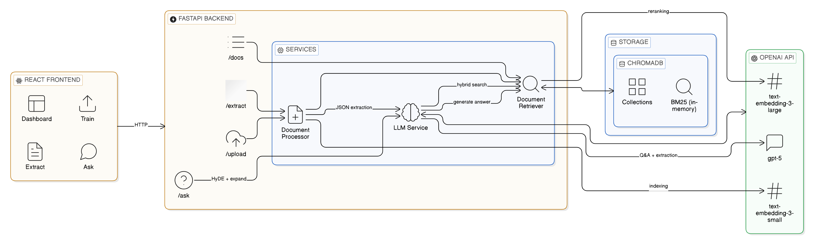

# Logistics Document AI

An AI system for logistics document processing — upload PDFs, DOCX, or TXT files, ask natural-language questions with fully grounded answers, and extract structured shipment data as JSON.

---

## Table of Contents

1. [Architecture](#architecture)
2. [Tech Stack](#tech-stack)
3. [Chunking Strategy](#chunking-strategy)
4. [Retrieval Pipeline](#retrieval-pipeline)
5. [Guardrails](#guardrails)
6. [Confidence Scoring](#confidence-scoring)
7. [Structured Extraction](#structured-extraction)
8. [Logging](#logging)
9. [API Reference](#api-reference)
10. [Running Locally](#running-locally)
11. [Docker Deployment](#docker-deployment)
12. [Environment Variables](#environment-variables)
13. [Known Failure Cases](#known-failure-cases)
14. [Improvement Ideas](#improvement-ideas)

---

## Architecture



**Two fully separate pipelines:**

| Mode | Flow | Storage |
|---|---|---|
| **RAG Chatbot** | Upload → chunk → embed → ChromaDB → hybrid retrieval → grounded answer | ChromaDB (persisted to disk) |
| **Direct Extract** | Upload → parse text → GPT JSON extraction | Nothing stored |

---

## Tech Stack

| Layer | Technology |
|---|---|
| Frontend | React 19, Vite 8 |
| Backend | FastAPI 0.115, Python 3.11 |
| Vector store | ChromaDB `PersistentClient` |
| Indexing embeddings | OpenAI `text-embedding-3-small` (1536-dim) |
| Reranking embeddings | OpenAI `text-embedding-3-large` (3072-dim) |
| BM25 | `rank-bm25` (BM25Okapi) |
| LLM | OpenAI `gpt-5` (configurable via `OPENAI_MODEL`) |
| PDF parsing | PyMuPDF (`fitz`) |
| DOCX parsing | `python-docx` |
| Containerisation | Docker + Docker Compose |

---
## Hosted link

I have hosted this app here: 
Frontend: https://ai-application-ten.vercel.app 

Backend: https://ai-application-fdcp.onrender.com


## Chunking Strategy

> **File:** `backend/processor.py`

Fixed-size chunking is avoided entirely. Logistics documents have three structurally distinct content types, each chunked differently:

### 1. KV Block (`kv_block`)

```
Shipper: ACME Freight Inc
Address: 123 Main St
City: Chicago, IL 60601
Contact: John Smith
```

Consecutive `Key: Value` lines — matched by `^[\w\s\-\.\/()\[\]]{1,50}:\s+\S.*$` — are grouped into **one atomic chunk** per contiguous run.

**Why:** A question like *"What is the shipper's address?"* requires name + address + city in a single retrieval hit. If stored individually, the embedding model finds the name chunk but the address chunk has a lower similarity score and may not be retrieved. Grouping ensures the full record lands together, so the LLM always has the complete context.

### 2. Table Row (`table_row`)

```
TABLE: Weight: 4200 lbs | Class: 70 | Commodity: Steel Coils | Rate: $2.15/lb
```

Tables are extracted from PDFs via `page.find_tables()` and from DOCX via `doc.tables`. Each data row is serialised as `Header: value | Header: value` with a `TABLE:` prefix, one chunk per row.

**Why:** The `TABLE:` prefix tells the embedding model this is structured data. Headers are prepended to each cell so chunks are self-contained — `4200` alone is meaningless; `Weight: 4200 lbs` is not. This aligns naturally with user queries like *"what is the freight weight?"*

### 3. Narrative (`narrative`)

Free-form text (payment terms, special instructions, legal clauses) split on **sentence boundaries** into 500-character windows with 100-character overlap.

**Why:** Prose needs overlap so a sentence straddling a boundary is not split mid-thought. 500 chars ≈ 80–100 tokens — specific enough to score high cosine similarity, large enough to carry full semantic context for `text-embedding-3-small`. Sentence-boundary splitting (not character-boundary) prevents cutting mid-sentence.

### Parameters

| Parameter | Value | Rationale |
|---|---|---|
| `CHUNK_SIZE` | 500 chars | ~80–100 tokens, optimal for `text-embedding-3-small` |
| `CHUNK_OVERLAP` | 100 chars | 20% overlap prevents boundary information loss |
| `MIN_CHUNK` | 15 chars | Keeps short but critical lines like `Rate: $1,250` |

---

## Retrieval Pipeline

> **Files:** `backend/retriever.py`, `backend/llm_service.py`, `backend/main.py`

Every `/ask` query runs a four-step pipeline. No step is optional — all four run serially:

```
User query: "What is the carrier rate?"
│
├─► [1] HyDE (Hypothetical Document Embeddings)
│       LLM generates a fake logistics document passage that *would*
│       answer the question:
│         → "The carrier rate is $1,250.00 per load, payable net 30 days."
│       This embeds 20–30% closer to the actual document text than the
│       raw question does. Narrows the semantic gap between query language
│       ("what is the carrier rate?") and document language ("Rate: $1,250").
│
├─► [2] Multi-Query Expansion
│       LLM generates 2 alternative phrasings using different logistics
│       terminology:
│         → ["freight charge amount", "trucking rate per load"]
│       Catches documents using "Freight Charge", "All-In Rate",
│       "Transportation Cost", etc. instead of "Rate".
│
├─► [3] Hybrid Retrieval
│       Dense (ChromaDB, text-embedding-3-small)
│         Run for: original + 2 expanded + HyDE  →  4 ranked lists
│       BM25 (rank-bm25, BM25Okapi, lazy-cached per document)
│         Run for: original + 2 expanded           →  3 ranked lists
│       RRF (Reciprocal Rank Fusion, k=60)
│         Merges all 7 ranked lists → single candidate set
│         score(chunk) = Σ  1 / (k + rank_in_list)
│
└─► [4] Reranking (text-embedding-3-large)
        Re-embeds query + all RRF candidates at 3072-dim (2× indexing fidelity).
        Sorted by cosine similarity → top-k passed to LLM.
        Cheap: only 24 chunks re-embedded, not the full corpus.
```

### Why each step matters

| Step | Problem solved |
|---|---|
| HyDE | Query language ≠ document language. "What is the pickup date?" has low cosine similarity to "Pickup: 2024-03-15". The fake passage bridges this gap. |
| Expansion | Synonym variation. "carrier" / "freight company" / "trucking provider" / "motor carrier" all mean the same entity. Dense search misses whichever term the document uses. |
| BM25 | Exact keyword matching. Shipment IDs, carrier names, reference numbers, dollar amounts — dense search dilutes these in the embedding space. BM25 finds them exactly. |
| RRF | Combining ranked lists without normalising incompatible scores (cosine similarity vs BM25 score). RRF is score-agnostic — only rank position matters. |
| 3-large reranking | 1536-dim embeddings used for indexing trade off fidelity for speed. Re-embedding the small candidate set at 3072-dim reorders it with twice the semantic resolution. |

### BM25 index

Built lazily on first query per document and cached in `self._bm25_cache` (dict keyed by `doc_id`). Invalidated on `delete()`. In multi-worker deployments, each worker builds its own cache independently (correctness is preserved; memory is duplicated).

---

## Guardrails

> **File:** `backend/retriever.py` → `retrieve()`, `backend/main.py` → `ask_question()`

The system refuses to answer when retrieved context is not relevant enough to ground a faithful answer.

### Mechanism

1. After all dense queries complete, `best_dense_sim` = max cosine similarity across all dense result sets.
2. If `best_dense_sim < 0.25` (`SIMILARITY_THRESHOLD`), `guardrail_triggered = True`.
3. The LLM is **never called**. The API returns immediately with:
   ```json
   {
     "answer": "Not found in document",
     "confidence": 0.18,
     "source_chunks": [],
     "guardrail_triggered": true
   }
   ```

### Prompt constraint (second layer)

Even when the guardrail does not trigger, the LLM system prompt enforces strict grounding:

- Answer **only** from the provided context chunks
- If the answer is absent: respond with exactly *"The answer is not available in the provided document."*
- Never speculate or infer beyond the text
- Quote exact figures, names, and dates as they appear

### Why 0.25

At cosine similarity below 0.25 with `text-embedding-3-small` on logistics documents, the retrieved chunks share no meaningful semantic overlap with the query. Passing them to the LLM would cause fabrication. The threshold is deliberately conservative — a false negative (refusing a valid question) is preferable to a false positive (a fabricated answer presented as fact).

---

## Confidence Scoring

> **File:** `backend/retriever.py` → `compute_confidence()`

```python
confidence = top_score * 0.6 + mean(top_5_scores) * 0.4
```

A blend of best single-chunk similarity and average across the top-5:

- **`top_score × 0.6`** — rewards finding one highly relevant chunk. A single perfect match should produce high confidence.
- **`mean(top_5) × 0.4`** — rewards broad coverage. If only one chunk is relevant but the rest are near zero, the mean drags the score down, signalling a narrow or fragile answer.

**Output:** `float ∈ [0.0, 1.0]`

**UI interpretation:**

| Range | Label | Colour | Meaning |
|---|---|---|---|
| < 0.25 | Blocked | — | Guardrail triggered; answer not shown |
| 0.25–0.50 | Low | Red | Weak context match — treat with caution |
| 0.50–0.75 | Medium | Amber | Partial match — answer likely but may be incomplete |
| ≥ 0.75 | High | Green | Strong grounding across multiple relevant chunks |

> **Important:** Confidence reflects **retrieval quality**, not answer correctness. A high confidence score on a document that contains incorrect information will produce an accurate retrieval of incorrect data.

---

## Structured Extraction

> **Files:** `backend/llm_service.py` → `extract_fields()`, `backend/main.py` → `POST /extract-file`

Direct extraction does **not** use RAG or ChromaDB. The full parsed document text is sent to GPT in a single prompt with `response_format: {"type": "json_object"}` (JSON mode) — guaranteeing valid JSON output with no markdown or commentary.

**Extracted fields:**

| Field | Type | Format |
|---|---|---|
| `shipment_id` | `string \| null` | Reference / confirmation number |
| `shipper.name` | `string \| null` | |
| `shipper.address` | `string \| null` | |
| `consignee.name` | `string \| null` | |
| `consignee.address` | `string \| null` | |
| `pickup_datetime` | `string \| null` | ISO 8601: `YYYY-MM-DDTHH:MM:SS` |
| `delivery_datetime` | `string \| null` | ISO 8601 |
| `equipment_type` | `string \| null` | e.g. `Dry Van`, `Reefer`, `Flatbed` |
| `mode` | `string \| null` | e.g. `FTL`, `LTL`, `Intermodal` |
| `rate` | `float \| null` | Number only — no currency symbol or units |
| `currency` | `string \| null` | ISO 4217: `USD`, `CAD`, `EUR` |
| `weight` | `float \| null` | Number only — no units |
| `carrier_name` | `string \| null` | |

Missing fields return `null`. The React UI shows found fields in a table and collapses missing fields under a disclosure element.

---

## Logging

> **File:** `backend/main.py` (config), propagated to `processor`, `retriever`, `llm_service`

Two verbosity levels — switch by changing `"level"` in the `logistics` logger config in `main.py`.

**INFO** (default) — one summary block per upload, one line per query:
```
19:42:11  INFO   logistics  ━━━━━━━━━━━━━━━━━━━━━━━━━━━━━━━━━━━━━━━━━━━━━━━━
19:42:11  INFO   logistics  UPLOAD  rate_confirmation.pdf  (.pdf)
19:42:11  INFO   logistics    File size : 84,221 bytes
19:42:11  INFO   logistics    Pages     : 3
19:42:11  INFO   logistics    Full text : 6,432 chars
19:42:12  INFO   logistics    Chunks    : 28 total  —  kv_block: 12  narrative: 9  table_row: 7
19:42:13  INFO   logistics    Indexed   : 28 chunks embedded and stored in ChromaDB
19:42:15  INFO   logistics  ASK  doc=3f9c1a2e…  q=What is the carrier rate?
19:42:17  INFO   logistics    Done  confidence=0.881  chunks_used=6
```

**DEBUG** — every chunk, every retrieval hit, every rerank score:
```
19:42:12  DEBUG  logistics    [  0] kv_block    p1  143 chars │ Shipper: ACME Freight Inc ↵ Address: 123 Main…
19:42:16  DEBUG  logistics    Dense [What is the carrier rate?] → top sim=0.821  chunks=[2,5,1]
19:42:16  DEBUG  logistics    Dense [The carrier rate is $1,250…] → top sim=0.893  chunks=[2,1,5]
19:42:16  DEBUG  logistics    BM25  [What is the carrier rate?] → hits=8  top_chunks=[2,3,7]
19:42:16  DEBUG  logistics    RRF merged → 12 candidates
19:42:16  DEBUG  logistics    Rerank (text-embedding-3-large): 12 → 6  top_sim=0.891
```

---

## API Reference

### `POST /upload`
Parse, chunk, embed, and index a document.

**Request:** `multipart/form-data`, field `file` (`.pdf`, `.docx`, `.txt`)

**Response:**
```json
{
  "doc_id": "3f9c1a2e-...",
  "filename": "rate_confirmation.pdf",
  "chunk_count": 28,
  "page_count": 3
}
```

---

### `POST /ask`
Hybrid RAG Q&A against a single indexed document.

**Request:**
```json
{ "doc_id": "3f9c1a2e-...", "question": "What is the carrier rate?" }
```

**Response:**
```json
{
  "answer": "The carrier rate is $1,250.00 USD per load.",
  "confidence": 0.8812,
  "source_chunks": [
    {
      "text": "Rate: $1,250.00\nCurrency: USD\nMode: FTL",
      "page_number": 1,
      "similarity": 0.891,
      "chunk_type": "kv_block"
    }
  ],
  "guardrail_triggered": false
}
```

---

### `POST /extract-file`
Extract structured shipment fields directly from an uploaded file. Nothing is indexed or stored.

**Request:** `multipart/form-data`, field `file`

**Response:**
```json
{
  "doc_id": "rate_confirmation.pdf",
  "data": {
    "shipment_id": "LD53657",
    "shipper": { "name": "ACME Corp", "address": "123 Main St, Chicago IL" },
    "consignee": { "name": "XYZ Logistics", "address": "7470 Cherry Ave, Fontana CA" },
    "pickup_datetime": "2024-03-15T08:00:00",
    "delivery_datetime": "2024-03-16T17:00:00",
    "equipment_type": "Dry Van",
    "mode": "FTL",
    "rate": 1250.00,
    "currency": "USD",
    "weight": 42000.0,
    "carrier_name": "Swift Transportation"
  }
}
```

---

### `GET /docs`
List all indexed documents. Returns upload timestamp, chunk count, page count.

### `GET /docs/{doc_id}`
Full collection info including chunk-level metadata and text previews.

### `DELETE /docs/{doc_id}`
Permanently delete a document's ChromaDB collection and BM25 cache.

### `GET /health`
Liveness check. Returns `{"status": "ok"}`.

---

## Running Locally

**Prerequisites:** Python 3.11+, Node 20+, OpenAI API key.

```bash
# Clone
git clone <repo> && cd logistics-document-ai

# Backend
python -m venv venv
venv\Scripts\activate          # Windows
# source venv/bin/activate     # Mac / Linux
pip install -r requirements.txt

cd backend
uvicorn main:app --reload --port 8000

# Frontend (separate terminal)
cd frontend/react-app
npm install
npm run dev                    # → http://localhost:5173
```

Create a `.env` file at the repo root:
```
OPENAI_API_KEY=sk-...
OPENAI_MODEL=gpt-5
```

The Vite dev server proxies all `/upload`, `/ask`, `/docs`, `/extract-file` requests to `localhost:8000`. No CORS configuration needed in development.

---

## Docker Deployment

```bash
# 1. Add your API key
echo "OPENAI_API_KEY=sk-..." > .env

# 2. Build and run
docker compose up --build

# App available at http://localhost:8000
# Swagger UI at  http://localhost:8000/api-docs
```

**Build stages:**

```
Stage 1 — node:20-alpine
  npm ci && npm run build  →  React static files in /dist

Stage 2 — python:3.11-slim
  pip install requirements.txt
  COPY backend source
  COPY /dist  →  backend/static/dist/
  FastAPI serves React SPA for all non-API routes (catch-all route)
  uvicorn main:app --host 0.0.0.0 --port 8000
```

**ChromaDB persistence:** The `chroma_data` named Docker volume survives container rebuilds, restarts, and `docker compose down`. Indexed documents are never lost on redeploy. To wipe it: `docker volume rm logistics-document-ai_chroma_data`.

---

## Environment Variables

| Variable | Required | Default | Description |
|---|---|---|---|
| `OPENAI_API_KEY` | Yes | — | OpenAI secret key |
| `OPENAI_MODEL` | No | `gpt-5` | Chat completion model for Q&A and extraction |
| `CHROMA_DIR` | No | `../chroma_db` | ChromaDB persistence path (overridden to `/app/chroma_db` in Docker) |
